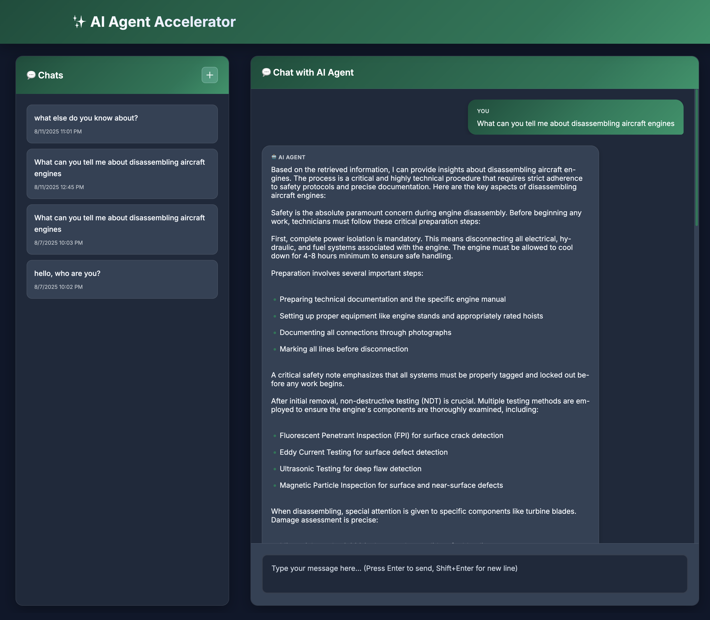
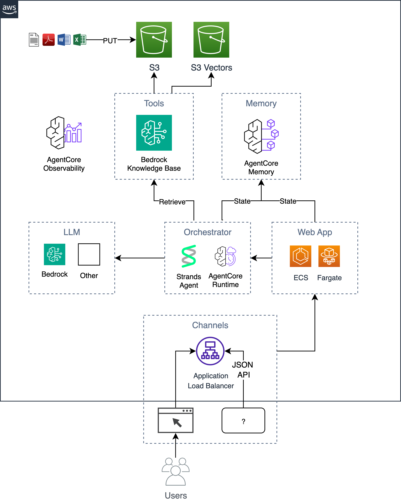

# ai-agent-accelerator

Get up and running quickly with an AI agent application on AWS using Bedrock AgentCore.

This project is a sample reference implementation that showcases how to quickly build an AI agent using the Bedrock AgentCore service building blocks. The implementation is fully serverless leveraging AgentCore Runtime, AgentCore Memory, AgentCore Observability, and Amazon S3 Vectors for Agentic RAG, eliminating the need to run databases.

The agent is built using the [Strands Agent](https://strandsagents.com) Python library and hosted on the [AgentCore Runtime](https://docs.aws.amazon.com/bedrock-agentcore/latest/devguide/agents-tools-runtime.html). It uses Strand's built-in `retrieve` tool to perform semantic search using [Bedrock Knowledge Bases](https://aws.amazon.com/bedrock/knowledge-bases/), which ingests documents from an [S3 bucket](https://aws.amazon.com/s3/) and stores the indexed vectors in [S3 Vectors](https://aws.amazon.com/s3/features/vectors/). User conversation state and history are fully managed by [AgentCore Memory](https://docs.aws.amazon.com/bedrock-agentcore/latest/devguide/memory-getting-started.html). Users interact with the agent via a web app that provides both a web GUI and an HTTP JSON API, hosted as a container on [ECS Fargate](https://docs.aws.amazon.com/AmazonECS/latest/developerguide/AWS_Fargate.html) behind an [ALB](https://aws.amazon.com/elasticloadbalancing/application-load-balancer/). The web app is built using [Python Flask](https://flask.palletsprojects.com) and [HTMX](https://htmx.org/).

This implementation evolved from the [AI Chat Accelerator implementation](https://github.com/aws-samples/ai-chat-accelerator) which was developed over a year ago and implemented traditional RAG.

*Note that at the time of this release (Aug 2025), the Bedrock AgentCore services are in preview.



## Architecture



## Key Features

- Deployable in under 15 minutes (instructions below)
- Ask questions and get answers
- Implements Agentic RAG
- Easily add additional tools for the agent to use
- See conversation history and select to see past conversations
- Built-in auto scaling architecture (see docs below)
- End to end observability with AgentCore GenAI observability and OpenTelemetry (OTEL)

## Usage

Follow the 6 step process below for deploying this solution into your AWS account.

1. Setup/Install prerequisites
2. Deploy cloud infrastructure
3. Deploy application code
4. Upload your documents to the generated S3 bucket
5. Trigger the Bedrock Knowledge Base sync
6. Start chatting with your documents in the app

### 1. Setup/Install prerequisites

- [Enable the Bedrock models you are using for both the KB ingestion and app generation](https://docs.aws.amazon.com/bedrock/latest/userguide/model-access.html)
- [AWS CLI](https://docs.aws.amazon.com/cli/latest/userguide/getting-started-install.html) - ensure you have the latest version as this is using preview APIs
- [Terraform](https://developer.hashicorp.com/terraform/tutorials/aws-get-started/install-cli)
- [Docker Desktop](https://www.docker.com/products/docker-desktop/)
- [jq CLI](https://jqlang.github.io/jq/download/)
- [Python 3](https://www.python.org/downloads/)
- [boto3](https://boto3.amazonaws.com/) (latest)

### 2. Deploy cloud infrastructure

Export required environment variables.

```sh
export AWS_REGION=$(aws configure get region || echo "us-east-1")
export ACCOUNT=$(aws sts get-caller-identity --query Account --output text)
export BUCKET=tf-state-${ACCOUNT}
```

Optionally, create an s3 bucket to store terraform state (this is recommended since the initial db password will be stored in the state). If you already have an s3 bucket, you can update the `BUCKET` variable with the name of your bucket (e.g., `export BUCKET=my-s3-bucket`).

```sh
aws s3 mb s3://${BUCKET}
```

Define your app name (note: avoid `_`s and `-`s, as AgentCore does not allow dashes for some reason):

```sh
export APP_NAME=agent
```

Set template input parameters, like app `name` in `terraform.tfvars`.

```sh
cd iac
cat << EOF > terraform.tfvars
name = "${APP_NAME}"
tags = {
  app = "${APP_NAME}"
}
EOF
```

Deploy using terraform.

```sh
terraform init -backend-config="bucket=${BUCKET}" -backend-config="key=${APP_NAME}.tfstate"
terraform apply
```

### 3. Deploy application code

Now that the infrastructure has been deployed, you can build the agent and app containers and deploy them on top of the infrastructure.

#### Deploy the Agent to the AgentCore Runtime

*Important - if you're running this on an `amd64` machine, you'll need to run the following commands since AgentCore requires building of `arm64` images.

```sh
# Create a new builder instance and bootstrap it
docker buildx create --name multiarch --driver docker-container --use
docker buildx inspect --bootstrap
```

Run the agent deploy script. Note the reason for this is that support for AgentCore has not yet been added to IaC tools. Ensure that you have boto3 installed and accessible in this directory (`make init && make install`).

```sh
export KB_ID=$(terraform output -raw bedrock_knowledge_base_id)
cd ../agent
make deploy app=${APP_NAME} kb=${KB_ID}
```

You should see output like this:
```
...
export AGENTCORE_RUNTIME_ARN="arn:aws:bedrock-agentcore:<region>:<account>:runtime/agent-<suffix>"
export MEMORY_ID="agent-<suffix>"
```

Our ECS web frontend needs to be able to call our agent, so we'll need to set a terraform input parameter and then re-apply our terraform (note that we only have to do this step due to lack of IaC support).

Copy/paste the `export` commands from the previous output into your terminal.

```sh
export AGENTCORE_RUNTIME_ARN="arn:aws:bedrock-agentcore:<region>:<account>:runtime/agent-<suffix>"
export MEMORY_ID="agent-<suffix>"
```

Now add these variables to our terraform input.

```sh
cd ../iac
cat << EOF >> terraform.tfvars
agentcore_runtime_arn = "${AGENTCORE_RUNTIME_ARN}"
agentcore_memory_id = "${MEMORY_ID}"
EOF
```

Then re-apply
```sh
terraform apply
```

#### Deploy the Frontend web application

Now we're ready to deploy the web frontend.

The first time you deploy you can run the following to build the base image and app image together.

```sh
cd ..
make baseimage && make deploy app=${APP_NAME}
```

After the initial deployment, you can iterate on code changes faster by only rebuilding the code layers and re-deploying.

```sh
make deploy app=${APP_NAME}
```

### 4. Upload your documents to the generated S3 bucket

```sh
cd iac
export DOCS_BUCKET=$(terraform output -raw s3_bucket_name)
aws s3 cp /path/to/docs/ s3://${DOCS_BUCKET}/ --recursive
```

### 5. Call the Bedrock Knowledge Base Sync API

```sh
cd iac
make sync
```

Note that this script calls the `bedrock-agent start-ingestion-job` API. This job will need to successfully complete before the agent will be able to answer questions about your documents.

### 6. Start chatting with your documents in the app

```sh
open $(terraform output -raw endpoint)
```

## Scaling

This architecture can be scaled using two primary levers:

1. ECS horizontal scaling
2. ECS vertical scaling
3. Bedrock scaling

### ECS horizontal scaling

The preferred method of scaling is horizontal autoscaling. Autoscaling is enabled by default and set to scale from 1 to 10 replicas based on an average service CPU and memory utilization of 75%. See the [Terraform module autoscaling input parameters](https://registry.terraform.io/modules/terraform-aws-modules/ecs/aws/latest/submodules/service?tab=inputs) to fine tune this.

### ECS vertical scaling

The size of the individual fargate tasks can be scaled up using the [cpu and memory parameters](./iac/ecs.tf).

### Bedrock scaling

Bedrock cross-region model inference is recommended for increasing throughput using [inference profiles](https://docs.aws.amazon.com/bedrock/latest/userguide/inference-profiles.html).

## Observability

This accelerator ships with OpenTelemetry auto instrumented code for flask, boto3, and AgentCore via the [aws-opentelemetry-distro](https://pypi.org/project/opentelemetry-distro/) library. It will create traces that are available in CloudWatch GenAI Observability. These traces can be useful for understanding how the AI agent is running in AWS. You can see how an HTTP request is broken down in terms of how much time is spent on various external calls all the way through Bedrock AgentCore Runtime through the Strands framework, to LLM calls.


### Disabling tracing

If you'd like to disable the tracing to AWS X-Ray, you can remove the OTEL sidecar container and dependencies from the ECS task definition as shown below.

```
      dependsOn = [
        {
          containerName = "otel"
          condition     = "HEALTHY"
        }
      ]
    },
    otel = {
      image   = "public.ecr.aws/aws-observability/aws-otel-collector:v0.41.2"
      command = ["--config=/etc/ecs/ecs-default-config.yaml"]
      healthCheck = {
        command     = ["/healthcheck"]
        interval    = 5
        timeout     = 6
        retries     = 5
        startPeriod = 1
      }
    },
```

## Development

```
 Choose a make command to run

  init           run this once to initialize a new python project
  install        install project dependencies
  start          run local project
  baseimage      build base image
  deploy         build and deploy container
  up             run the app locally using docker compose
  down           stop the app
  start-docker   run local project using docker compose
```

### Running locally

In order to run the app locally, create a local file named `.env` with the following variables. The variable, `KNOWLEDGE_BASE_ID` comes from the Terraform output (`cd iac && terraform output`).

```sh
KNOWLEDGE_BASE_ID=
```

After setting up your `.env` file, you can run the app locally in docker to iterate on code changes before deploying to AWS. When running the app locally it uses the remote Amazon Bedrock Knowledge Base API. Ensure that you have valid AWS credentials. Running the `make up` command will start an OTEL collector and a web server container.

```sh
make up
```

To stop the environment simply run:

```sh
make down
```
